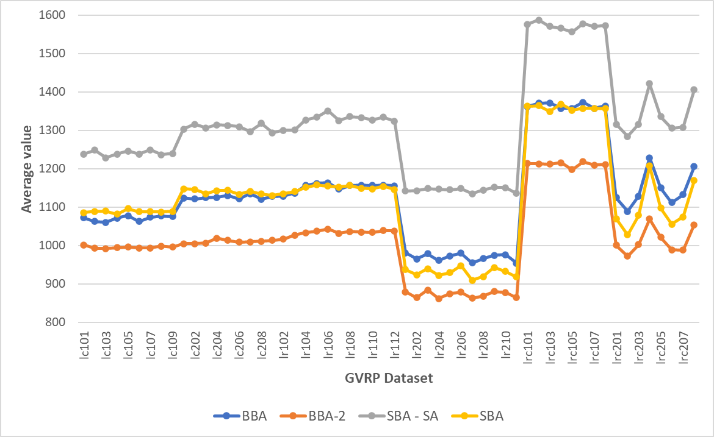

# Bees Algorithm for Green Vehicle Routing Problem

## Introduction
This repository contains code for Bees Algorithm on Green Vehicle Routing Problem. We have implemented and tested the following variants of Bees Algorithm:
- [x] Basic Bees Algorithm
- [x] Standard Bees Algorithm
- [x] Reduced(2 parameter) Bees Algorithm
- [x] Improved Bees Algorithm(with Simulated Annealing)

We have tested and compared the algorithms on the following datasets:
- [x] Goeke's Dataset(2017)
- [ ] Erdogan

Apart from that, I have added a few data collection and quality of life utilities:
- [x] Collect N runs of the algorithm on the same scene (```src/Data Collection/CollectRuns.py```)
- [x] Perform basic statistical analysis on the runs, like mean, deviation, min, max (```src/Data Collection/statistics.py```)
- [x] Read statisitcal properties for all settings and construct a table out of it (```src/Data Collection/TableStats.py```)
- [x] Grid Search to find optimal hyperparameter setting (```src/Data Collection/GridSearch.py```)
- [ ] Plot a graph to visualize the results (todo) 

Note that all of the above programs either use Multiprocessing by default (can be enabled by setting 
```python 
MULTIPROCESSING = True
``` 
or an analogous variable) or have a Multiprocessing alternative(```src/Data Collection/statistics_multiprocessing.py```) in order to help collect the data fast. Please set number of workers according to the number of cores available. You might not want to use up all your cores.

## Installation and Requirements

### Requriements
| Package | Version | Purpose |
| --- | ----------- | ----------- |
| Numpy | 1.22.x | Matrix and Array computations|
| Open CV | contrib, 4.5.x.x | Visualisation of output |
| Pandas | 1.4.x | Dataset |
| tqdm | 4.64.x | Progress bar for data collection programs |

### Installation Steps
- Clone the respository
    ```bash
    git clone https://github.com/Aryan-Satpathy/BA-GVRP.git
    ```
- Make a virtual environment
    ```bash
    cd BA-GVRP
    virtualenv <env_name>
    source <env_name/bin/activate>
    ```
    To deactivate the environment
    ```bash
    deactivate
    ```
- Install required libraries
    ```bash
    pip install -r requirements.txt
    ```

## Running Code
```bash
cd src/
python main.py -- dataset 4 --useNFE --n 60000 --basic --gui
```
If you want to have a look at the available command line arguments
```bash
python main.py --help
```

## Collecting Data
- **CollectRuns.py**: Change ```NumberOfRuns = 100``` (line 22) to the number of runs you want to collect your data for. It will collect 100 runs for all the scenes in the given dataset. You can select algorithm by changing ```args = ['--basic', '--reduced']``` (line 25).
- **statistics.py**: You can run 
    ```bash
    python statistics.py --help
    ```
    to understand the various command line arguments available. Most of the command line arguments are simply passed forward as command line arguments while calling ```main.py```.
- **GridSearch.py**: Change ```parameter_names = ['ns', 'nb'] # , 'nrb'] # , 'stlim', 'alpha']``` (line 24) and 
    ```python
    parameter_space = [
    [5, 10, 20], # ns
    [7, 8, 9, 10, 11], # nb
    ]# [5, 10, 20],
    # ]
    ```
    (line 26-30) to perform Grid Search for the parameters. Note that you need to add an argument in ```statistics.py``` or ```statistics_multiprocessing.py``` to change the Bees Algorithm on which hyperparameter tuning is performed. The program will only give you a table containing the results for all the possible combinations of the parameter space. One can then find out the best setting using any csv editor.
- **TableStats.py**: After data has been collected, one can use ```TableStats.py``` to get a table containing performance on the different scenes, for the different Bees Algorithm variants.

## Results
|  | 
|:--:| 
| *Results on Goeke Dataset(VRP 2017)* |
